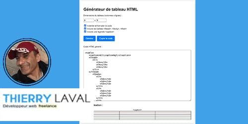

# 

## Auteur

👤 &nbsp; **Thierry LAVAL** [🇫🇷 Contactez moi 🇬🇧](<contact@thierrylaval.dev>)

* Github: [@Thierry Laval](https://github.com/thierry-laval)
* LinkedIn: [@Thierry Laval](https://www.linkedin.com/in/thierry-laval)
* Visitez ==> 🏠 [Site Web](https://thierrylaval.dev)

***

### 📎 Projet 38 - Création d'un tableau HTML automatiquement

_`Début du projet le 21/04/2025`_

***

## Générateur de tableau HTML

### Description

Un petit outil en ligne pour générer du code HTML de tableaux, avec prévisualisation et options personnalisables.

### Fonctionnalités

* **Définir le nombre de colonnes et de lignes**
* **Ajouter les balises `<thead>`, `<tbody>`, `<tfoot>`**
* **Ajouter une légende (`<caption>`)**
* **Voir le code généré en direct**
* **Copier le code en un clic**

## Utilisation
Ouvre `index.html` dans ton navigateur.

## Démo
(à compléter avec l’URL GitHub Pages si besoin)

### 📦 &nbsp; Utilisé dans ce projet

|  Langages  |  et Applications   |
|:----------:|:------------------:|
|   HTML5    | Visual Studio Code |
|    CSS3    |     Git/GitHub     |

***

#### Les contributions sont les bienvenues

Suivez les étapes suivantes :

* Fork du projet
* Créez une nouvelle branche (git checkout -b feature/ajout-fonctionnalite)
* Commit de vos modifications (git commit -am 'Ajout d'une nouvelle fonctionnalité')
* Push vers la branche (git push origin feature/ajout-fonctionnalite)
* Ouvrez une Pull Request

#### 📝 &nbsp; License

Ce projet est sous licence [MIT](LICENCE).

Copyright © 2025 [Thierry Laval](https://thierrylaval.dev)

#### €€€ Soutien

Si vous appréciez ce projet, vous pouvez me soutenir :

[Voir mon travail](https://github.com/thierry-laval)

[Créer un bon template](https://github.com/thierry-laval/P22-template-pour-un-readme)

***

### &hearts;&nbsp;&nbsp;&nbsp;&nbsp;Love Markdown

Donnez une ⭐️ &nbsp;si ce projet vous plaît !

FAN DE GITHUB !

<!-- [This is an image](https://myoctocat.com/assets/images/base-octocat.svg) -->

**[⬆ Retour en haut](#auteur)**  
